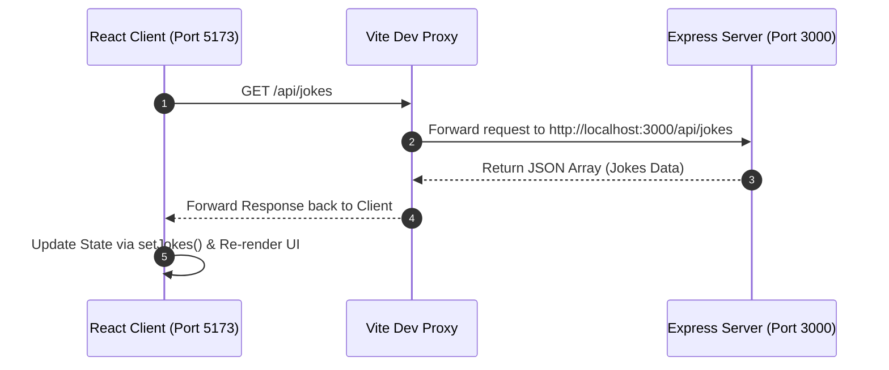

# 🔗 02. Frontend-Backend Connection (Full-Stack Setup)


A full-stack demonstration project demonstrating how to connect a React (Vite) frontend with an Express.js backend server. It highlights CORS management, development proxying, asynchronous data fetching via Axios, and state synchronization.

---

## 📌 Key Concepts & Learning Highlights

- **Full-Stack Architecture:** Decoupled client-server architecture with dedicated backend and frontend environments.
- **ES Modules (`import`/`export`):** Using ECMAScript module syntax across both Express backend (`"type": "module"`) and Vite React frontend.
- **Vite API Proxying (CORS Solution):** Configuring `vite.config.js` with `server.proxy` to forward requests matching `/api` to `http://localhost:3000`, bypassing browser CORS issues during development.
- **Asynchronous Data Fetching:** Utilizing `axios.get('/api/jokes')` inside React's `useEffect` lifecycle hook.
- **React State Management:** Managing fetched array data with `useState` and dynamically rendering lists with unique keys.

---

## 📁 Directory Tree Structure

```text
02FrontBack-connection/
├── Backend/
│   ├── .env                 # Environment configuration
│   ├── package.json         # Backend dependencies & script definitions
│   ├── package-lock.json    # Backend locked dependencies
│   └── server.js            # Express backend server serving API endpoints
│
└── Frontend/
    ├── .gitignore           # Git ignore file for frontend artifacts
    ├── eslint.config.js     # ESLint linting configuration
    ├── index.html           # HTML template root for React application
    ├── package.json         # Frontend dependencies (React 19, Axios, Vite)
    ├── package-lock.json    # Frontend locked dependencies
    ├── vite.config.js       # Vite build & development proxy configuration
    ├── public/              # Static assets directory
    └── src/
        ├── App.css          # App-specific styling
        ├── App.jsx          # Main React component (Axios fetch & render)
        ├── index.css        # Global CSS styling
        ├── main.jsx         # React DOM root entry point
        └── assets/          # Project images and icons
```

---

## 🔄 Architecture & Data Flow



---

## 🌐 API Endpoint Reference

### Backend (`server.js`)

| Method | Endpoint | Description | Response Format |
| :--- | :--- | :--- | :--- |
| `GET` | `/api/jokes` | Returns an array of joke objects (`id`, `title`, `content`) | `Array<Object>` |

---

## 🛠️ Setup & Running Locally

This project requires running both the **Backend** and **Frontend** servers simultaneously.

### Step 1: Start the Backend Server

```bash
# Navigate to the Backend directory
cd 02FrontBack-connection/Backend

# Install dependencies
npm install

# Start the Express server
npm start
```
*The backend server will run on `http://localhost:3000`.*

---

### Step 2: Start the Frontend Application

Open a second terminal window:

```bash
# Navigate to the Frontend directory
cd 02FrontBack-connection/Frontend

# Install dependencies
npm install

# Start the Vite development server
npm run dev
```
*The frontend application will launch at `http://localhost:5173` (or the URL printed by Vite).*

---

## 📦 Tech Stack & Dependencies

### Backend Tier
- **Express.js (`v5.2.1`):** Web server framework.
- **Node.js:** Server runtime (`type: module`).

### Frontend Tier
- **React (`v19.2.7`):** UI library for rendering component hierarchies.
- **Vite (`v8.1.1`):** Next-generation frontend build tool and dev server.
- **Axios (`v1.18.1`):** Promise-based HTTP client for API interactions.

---
*Created as part of the JavaScript Backend Development Series.*
