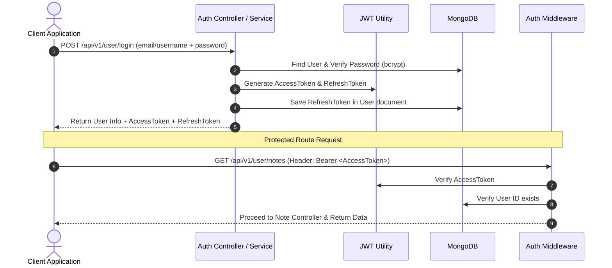

# 📝 03. Production-Ready Notes REST API


A robust, enterprise-grade **Notes RESTful API** built with **Express.js (v5)**, **MongoDB/Mongoose**, and **JWT Authentication**. It features a modular service-oriented architecture, complete user authentication workflow (JWT Access & Refresh Token rotation), password hashing, soft deletion, pagination, regex search, and standard response utility wrappers.

---

## 📌 Architecture & Design Highlights

- **Service-Oriented MVC Architecture:** Clean separation of concerns between Controllers (HTTP request handling), Services (Business logic), Models (Database Schemas), and Routes.
- **JWT Dual-Token Security:** Secure authentication leveraging short-lived Access Tokens and long-lived Refresh Tokens stored in MongoDB and extractable from Bearer headers or HTTP cookies.
- **Bcrypt Password Security:** 10-round salt hashing for user password persistence.
- **Custom Utility Suite:** Standardized `ApiError` class, `ApiResponse` formatter, `asyncHandler` higher-order wrapper, and custom input validators (`validateObjectId`, `validateQuery`, `validateRequired`).
- **High-Performance Pagination & Search:** Dynamic query building with regex filtering, page/limit sorting, and parallel execution using `Promise.all([find(), countDocuments()])`.
- **Soft Deletion & Status Flags:** Non-destructive soft deletion (`isDeleted`), toggleable favorite status (`isFavorite`), and archive status (`isArchived`).
- **Resilient Database Connector:** Custom Mongoose setup featuring DNS SRV lookup configuration and environment fallback handling.

---

## 📁 Directory Tree Structure

```text
03Notes-api/
├── .env.sample                 # Template for required environment variables
├── package.json                # Project dependencies and script definitions
├── package-lock.json           # Locked dependency manifest
├── public/                     # Static files directory
└── src/
    ├── app.js                  # Express app setup, middleware & route mounting
    ├── server.js               # Entry point: DB connection & server initialization
    ├── constants.js            # Global application constants (e.g. DB_NAME)
    │
    ├── config/
    │   └── db.js               # MongoDB connection handler with DNS fallbacks
    │
    ├── controllers/            # Controller layer parsing HTTP request/response
    │   ├── note.controller.js  # Request handlers for Note operations
    │   └── user.controller.js  # Request handlers for Auth & User operations
    │
    ├── middleware/             # Express middlewares
    │   ├── auth.middleware.js  # JWT token verification & route protection
    │   └── error.middleware.js # Global central error handling middleware
    │
    ├── models/                 # Mongoose schemas & database models
    │   ├── Note.model.js       # Note schema (Title, content, owner, flags)
    │   └── User.model.js       # User schema (Username, email, password, refreshToken)
    │
    ├── routes/                 # Route endpoints mapping
    │   ├── note.routes.js      # Protected endpoints for note CRUD
    │   └── user.routes.js      # Endpoints for register, login, refresh, logout
    │
    ├── services/               # Core business logic layer
    │   ├── auth.service.js     # Auth logic, bcrypt, token creation & cleanup
    │   └── note.service.js     # Note CRUD, search, filter, pagination logic
    │
    ├── utils/                  # Reusable helper utilities
    │   ├── ApiError.js         # Custom Error subclass for standardized HTTP errors
    │   ├── ApiResponse.js      # Standard response wrapper structure
    │   ├── asyncHandler.js     # Async catch wrapper replacing try/catch blocks
    │   ├── jwt.js              # Token generator functions (Access & Refresh)
    │   ├── validateObjectId.js # MongoDB ObjectId format validator
    │   ├── validateQuery.js    # Query string parser & sanitizer
    │   └── validateRequired.js # Mandated field check utility
    │
    └── validators/             # Custom request payload validators
```

---

## 🔐 Authentication & Authorization Flow



---

## 🌐 Complete API Endpoints Documentation

### 👤 User & Auth Routes (`/api/v1/user`)

| Method | Endpoint | Auth Required | Description |
| :--- | :--- | :---: | :--- |
| `POST` | `/api/v1/user/register` | ❌ | Register new user (`username`, `email`, `fullName`, `password`) |
| `POST` | `/api/v1/user/login` | ❌ | Authenticate user (`email` or `username` + `password`) |
| `POST` | `/api/v1/user/refresh-token` | ❌ | Refresh access token using `refreshToken` |
| `POST` | `/api/v1/user/logout` | 🔐 | Logout user & revoke stored refresh token |

---

### 📝 Note Management Routes (`/api/v1/user/notes`)

> 🔐 **Note:** All Note routes require a valid JWT Access Token via `Authorization: Bearer <TOKEN>` or Cookie.

| Method | Endpoint | Description | Query Parameters / Body |
| :--- | :--- | :--- | :--- |
| `POST` | `/api/v1/user/notes` | Create a new note | Body: `{ "title": "...", "content": "..." }` |
| `GET` | `/api/v1/user/notes` | Fetch all notes (Paginated & Filtered) | Query: `page`, `limit`, `sortBy`, `order`, `favorite`, `archived`, `search` |
| `GET` | `/api/v1/user/notes/search-notes` | Search notes by title or content | Query: `search=keyword` |
| `GET` | `/api/v1/user/notes/:noteId` | Retrieve single note by ID | Path: `:noteId` |
| `PATCH` | `/api/v1/user/notes/:noteId` | Update note title and/or content | Body: `{ "title": "...", "content": "..." }` |
| `DELETE` | `/api/v1/user/notes/:noteId` | Soft delete note (`isDeleted: true`) | Path: `:noteId` |
| `PATCH` | `/api/v1/user/notes/:noteId/favorite` | Toggle favorite status | Path: `:noteId` |
| `PATCH` | `/api/v1/user/notes/:noteId/archive` | Toggle archive status | Path: `:noteId` |

---

## ⚙️ Environment Configuration

Copy `.env.sample` to `.env` in the `03Notes-api` directory:

```env
PORT=5000
MONGODB_URL=mongodb+srv://<username>:<password>@<cluster-host>/<database-name>?retryWrites=true&w=majority
CORS_ORIGIN=*

ACCESS_TOKEN_SECRET=your_super_secret_access_token_key_here
ACCESS_TOKEN_EXPIRY=1d

REFRESH_TOKEN_SECRET=your_super_secret_refresh_token_key_here
REFRESH_TOKEN_EXPIRY=10d
```

---

## 🛠️ Local Installation & Development

1. **Navigate to project directory:**
   ```bash
   cd 03Notes-api
   ```

2. **Install dependencies:**
   ```bash
   npm install
   ```

3. **Configure Environment Variables:**
   Ensure `.env` is properly created with valid MongoDB credentials and JWT secrets.

4. **Launch Development Server:**
   ```bash
   npm run dev
   ```
   *Server starts with `nodemon` at `http://localhost:5000`.*

---

## 📦 Technology Stack & Dependencies

| Dependency | Version | Purpose |
| :--- | :--- | :--- |
| `express` | `^5.2.1` | Modern Web Application Framework |
| `mongoose` | `^9.9.1` | MongoDB Object Data Modeling (ODM) |
| `jsonwebtoken` | `^9.0.3` | Access & Refresh Token authentication |
| `bcrypt` | `^6.0.0` | Password hashing algorithm |
| `cookie-parser` | `^1.4.7` | Middleware for parsing HTTP request cookies |
| `cors` | `^2.8.6` | Enabling Cross-Origin Resource Sharing |
| `dotenv` | `^17.4.2` | Loading environment configurations |
| `nodemon` | `^3.1.14` | Hot-reloading development server tool |

---
*Created as part of the JavaScript Backend Development Series.*
