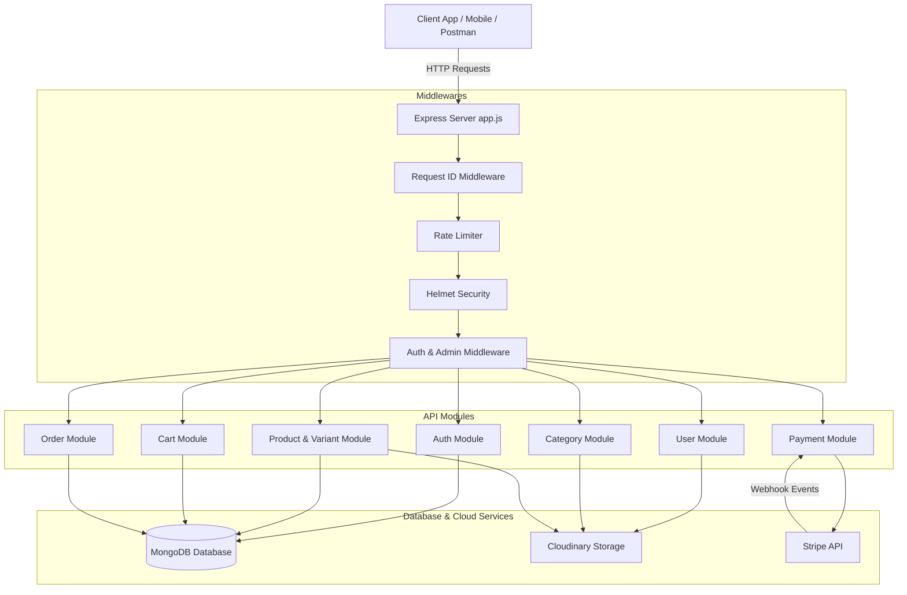
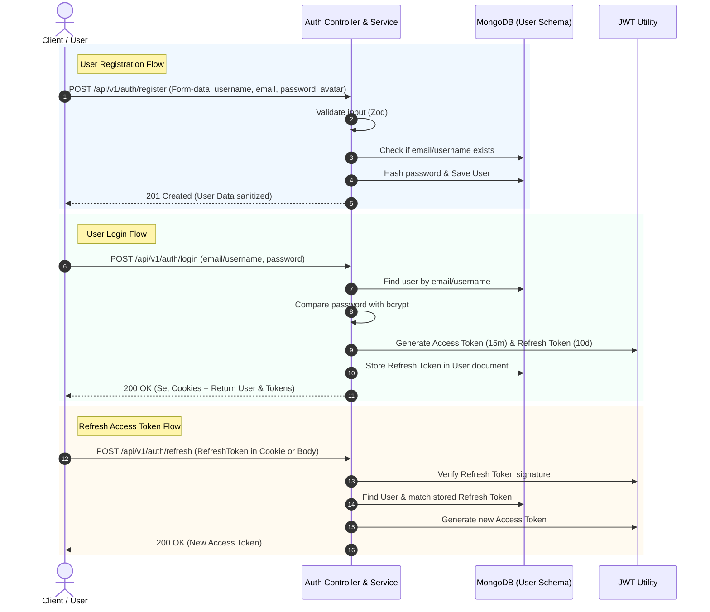
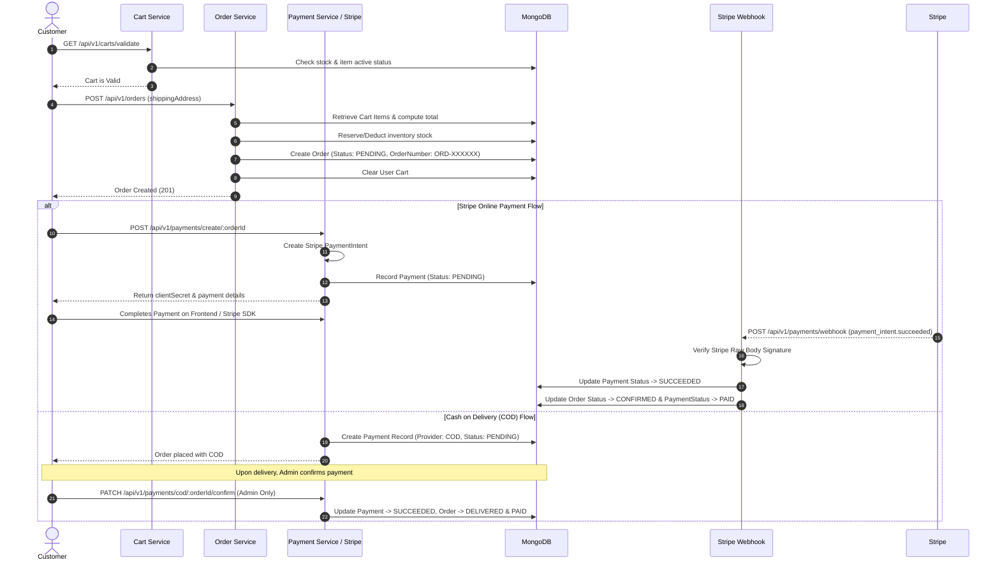
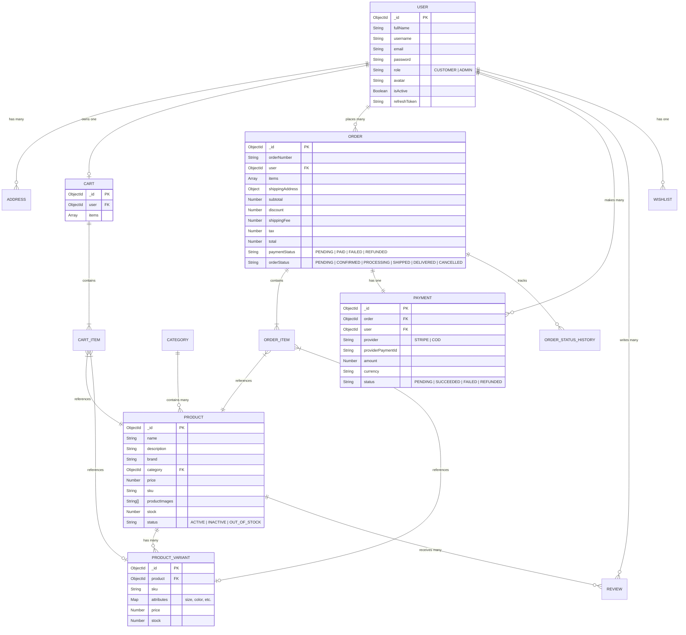

# 🛒 Modern E-Commerce Backend API (`08E-Commerce-api`)

A feature-rich, scalable, and production-ready **E-Commerce RESTful Backend API** built with **Node.js, Express.js, MongoDB, and Mongoose**. This project follows a clean **Modular Layered Architecture** (Routes → Controllers → Services → Models) and integrates modern security standards, Stripe payment gateways, Cloudinary image hosting, and robust error handling.

---

## 📋 Table of Contents

- [✨ Key Features](#-key-features)
- [🛠️ Tech Stack](#️-tech-stack)
- [🏗️ System Architecture](#️-system-architecture)
- [📊 Flow Diagrams](#-flow-diagrams)
  - [1. High-Level Architecture Diagram](#1-high-level-architecture-diagram)
  - [2. Authentication & Token Refresh Flow](#2-authentication--token-refresh-flow)
  - [3. Order Placement & Payment Flow](#3-order-placement--payment-flow)
  - [4. Entity Relationship Diagram (ERD)](#4-entity-relationship-diagram-erd)
- [📂 Directory Structure](#-directory-structure)
- [🔌 API Endpoints & Routes](#-api-endpoints--routes)
- [🗄️ Database Models & Schema Summary](#️-database-models--schema-summary)
- [🛡️ Security & Middleware](#️-security--middleware)
- [⚡ Getting Started & Setup](#-getting-started--setup)
- [⚙️ Environment Variables](#️-environment-variables)
- [📄 License & Author](#-license--author)

---

## ✨ Key Features

### 🔐 Authentication & User Authorization
- **Dual-Token System**: JWT Access Tokens (short-lived) & Refresh Tokens (long-lived).
- **Flexible Auth Storage**: Support for `Bearer` tokens in headers or secure HTTP-Only cookies.
- **Password Security**: Password hashing with `bcrypt`.
- **Role-Based Access Control (RBAC)**: Support for `CUSTOMER` and `ADMIN` roles.
- **Account Management**: Profile updates, password changes, avatar uploads, and soft-delete capabilities (`isActive: false`).

### 📦 Category & Product Catalog
- **Category Management**: Categories with slugs and Cloudinary-hosted category images.
- **Product Management**: Full CRUD operations for products with SKU codes, brand, stock, and pricing.
- **Product Variants**: Dynamic key-value attribute maps (e.g. Size, Color, Storage) with individual SKU tracking and dedicated pricing/stock.
- **Multi-Image Upload**: Support for uploading up to 5 product images simultaneously via Multer and Cloudinary.

### 🛒 Shopping Cart & Sync
- **Dynamic Pricing**: Prices are calculated dynamically from the database to prevent stale cart pricing.
- **Cart Validation & Sync**: Endpoints to validate cart item availability and synchronize carts when products/variants become out of stock or inactive.
- **Per-User Cart**: Embedded cart items with unique subdocument IDs for targeted item updates.

### 📦 Order Management & Fulfillment
- **Unique Order Numbers**: Automated human-readable order code generation (e.g., `ORD-XXXXXX`).
- **Embedded Address Snapshot**: Stores a snapshot of the shipping address at purchase time to preserve historical integrity.
- **Lifecycle Tracking**: Complete status tracking (`PENDING`, `CONFIRMED`, `PROCESSING`, `SHIPPED`, `DELIVERED`, `CANCELLED`, `RETURN_REQUESTED`, `RETURNED`).
- **Inventory Adjustment**: Automated inventory deduction on order creation and inventory restock on order cancellation.

### 💳 Stripe & Cash-on-Delivery (COD) Payments
- **Stripe Integration**: Payment Intent creation and checkout integration.
- **Automated Webhooks**: Stripe Webhook listener using raw body parsing to automatically verify signature and update order/payment statuses (`payment_intent.succeeded`, `payment_intent.payment_failed`).
- **Payment Retry & Refunds**: Endpoint for customers to retry failed payments and for admins to issue refunds.
- **Cash on Delivery (COD)**: Dedicated flow for manual COD payment confirmation by administrators.

### 🛡️ Production & Reliability Features
- **Rate Limiting**: Global API rate limiting via `express-rate-limit` to prevent abuse.
- **Request Tracing**: Unique `requestId` attached to every request header (`x-request-id`) for log tracing.
- **Security Headers**: OWASP security headers enforced via `helmet`.
- **Standardized Responses & Errors**: Centralized `ApiError`, `ApiResponse`, and `asyncHandler` wrappers.

---

## 🛠️ Tech Stack

- **Runtime**: Node.js (ES Modules)
- **Framework**: Express.js (v5)
- **Database**: MongoDB with Mongoose ORM (v9)
- **Authentication**: JSON Web Tokens (`jsonwebtoken`), `bcrypt`
- **Validation**: Zod schema validation
- **File Uploads**: `multer` + `cloudinary` SDK
- **Payment Gateway**: Stripe SDK (`stripe`)
- **Security & Utilities**: `helmet`, `cors`, `cookie-parser`, `express-rate-limit`, `morgan`

---

## 🏗️ System Architecture

The application uses a **Modular Component Architecture**, where each business area (Auth, Users, Products, Categories, Cart, Orders, Payments) is self-contained with its own model, controller, service, routes, and validator.

```
[ Client / Web / Mobile ]
         │
         ▼
[ Express Application (app.js) ]
  ├── Security & Global Middleware (Helmet, CORS, Rate Limit, Cookie Parser, Request ID)
  └── Centralized Router (/api/v1)
         │
         ├──► Auth Module        (/api/v1/auth)
         ├──► User Module        (/api/v1/users)
         ├──► Category Module    (/api/v1/categories)
         ├──► Product Module     (/api/v1/products)
         ├──► Cart Module        (/api/v1/carts)
         ├──► Order Module       (/api/v1/orders)
         └──► Payment Module     (/api/v1/payments)
                 │
                 ├──► Services (Business Logic)
                 ├──► Models (Mongoose / MongoDB)
                 └──► Third-Party Integrations (Stripe, Cloudinary)
```

---

## 📊 Flow Diagrams

### 1. High-Level Architecture Diagram



---

### 2. Authentication & Token Refresh Flow



---

### 3. Order Placement & Payment Flow



---

### 4. Entity Relationship Diagram (ERD)



---

## 📂 Directory Structure

```
08E-Commerce-api/
├── public/                 # Static asset temp folder
├── src/
│   ├── app.js              # Express app setup & middleware stack
│   ├── server.js           # Server entry point & DB connection initialization
│   ├── constants.js        # Global constants
│   ├── config/             # Environment & third-party configs
│   │   ├── env.config.js
│   │   ├── database.config.js
│   │   ├── cloudinary.config.js
│   │   └── stripe.config.js
│   ├── database/           # Models, migrations, and seeders
│   │   ├── models/
│   │   ├── migrations/
│   │   └── seeders/
│   ├── middleware/         # Application middlewares
│   │   ├── admin.middleware.js
│   │   ├── auth.middleware.js
│   │   ├── error.middleware.js
│   │   ├── multer.middleware.js
│   │   ├── rateLimit.middleware.js
│   │   └── requestId.middleware.js
│   ├── modules/            # Domain-driven feature modules
│   │   ├── addresses/      # User address management
│   │   ├── auth/           # Login, Register, Tokens, Logout
│   │   ├── cart/           # Cart operations & cart validation
│   │   ├── categories/     # Categories management
│   │   ├── coupons/        # Coupons & coupon usage schemas
│   │   ├── inventory/      # Inventory transaction tracking
│   │   ├── notifications/  # User notifications model
│   │   ├── orders/         # Order creation & status management
│   │   ├── payments/       # Stripe & COD payment workflows
│   │   ├── products/       # Products & Product Variants
│   │   ├── reviews/        # Product reviews schema
│   │   ├── users/          # User profile & administration
│   │   └── wishlist/       # User wishlist schema
│   ├── routes/
│   │   └── index.routes.js # Central endpoint mount file (/api/v1)
│   └── utils/              # Helper utilities
│       ├── ApiError.js
│       ├── ApiResponse.js
│       ├── asyncHandler.js
│       ├── cookieOptions.js
│       ├── jwt.js
│       ├── orderNumberGenerator.js
│       ├── sanitizeUser.js
│       └── validateObjectId.js
├── .env.sample             # Environment variable template
├── package.json
└── README.md
```

---

## 🔌 API Endpoints & Routes

All routes are prefixed with `/api/v1`.

### 🔑 Auth Routes (`/api/v1/auth`)
| Method | Endpoint | Access | Description |
| :--- | :--- | :--- | :--- |
| `POST` | `/register` | Public | Register user (Form-data with optional single `avatar` file) |
| `POST` | `/login` | Public | Login with email/username & password |
| `POST` | `/refresh` | Public | Refresh Access Token using Refresh Token |
| `POST` | `/logout` | Auth | Logout user & clear refresh token cookie |

### 👤 User Routes (`/api/v1/users`)
| Method | Endpoint | Access | Description |
| :--- | :--- | :--- | :--- |
| `GET` | `/profile` | Auth | Get current logged-in user profile |
| `PATCH` | `/profile` | Auth | Update profile details (Name, email, avatar image) |
| `PATCH` | `/change-password` | Auth | Change account password |
| `DELETE` | `/profile` | Auth | Soft-delete user profile (`isActive: false`) |
| `GET` | `/orders` | Auth | Get list of user orders |
| `GET` | `/orders/:orderId` | Auth | Get single order details |
| `PATCH` | `/addresses/:addressId/default` | Auth | Set primary default shipping address |
| `GET` | `/notifications` | Auth | Fetch user notifications |
| `PATCH` | `/notifications/:notificationId/read` | Auth | Mark single notification as read |
| `PATCH` | `/notifications/read-all` | Auth | Mark all notifications as read |
| `DELETE` | `/notifications/:notificationId` | Auth | Delete specific notification |

### 🏷️ Category Routes (`/api/v1/categories`)
| Method | Endpoint | Access | Description |
| :--- | :--- | :--- | :--- |
| `POST` | `/create` | Auth/Admin | Create new category (Upload category image) |
| `GET` | `/` | Auth | List all active categories |
| `GET` | `/:categoryId` | Auth | Get category details by ID |
| `PATCH` | `/:categoryId` | Auth/Admin | Update category details |
| `DELETE` | `/:categoryId` | Auth/Admin | Delete category |

### 🛍️ Product & Variant Routes (`/api/v1/products`)
| Method | Endpoint | Access | Description |
| :--- | :--- | :--- | :--- |
| `POST` | `/create` | Auth/Admin | Create product (Upload up to 5 images) |
| `GET` | `/` | Auth | List products with pagination & filters |
| `GET` | `/:productId` | Auth | Get product details by ID |
| `PATCH` | `/:productId` | Auth/Admin | Update product details/images |
| `DELETE` | `/:productId` | Auth/Admin | Delete product |
| `PATCH` | `/:productId/status` | Auth/Admin | Update product status (`ACTIVE`/`INACTIVE`) |
| `POST` | `/:productId/variants` | Auth/Admin | Add variant (Attributes, SKU, Price, Stock) |
| `GET` | `/:productId/variants` | Auth | List variants for a product |
| `GET` | `/:productId/variants/:variantId` | Auth | Get specific variant |
| `PATCH` | `/:productId/variants/:variantId` | Auth/Admin | Update variant details |
| `DELETE` | `/:productId/variants/:variantId` | Auth/Admin | Remove variant |
| `PATCH` | `/:productId/variants/:variantId/stock` | Auth/Admin | Adjust variant stock count |

### 🛒 Cart Routes (`/api/v1/carts`)
| Method | Endpoint | Access | Description |
| :--- | :--- | :--- | :--- |
| `POST` | `/` | Auth | Add product/variant to user cart |
| `GET` | `/` | Auth | View user shopping cart |
| `PATCH` | `/:itemId` | Auth | Update item quantity in cart |
| `DELETE` | `/:itemId` | Auth | Remove specific item from cart |
| `DELETE` | `/` | Auth | Clear entire cart |
| `GET` | `/summary` | Auth | Get cart price breakdown & totals |
| `GET` | `/validate` | Auth | Validate cart item availability before checkout |
| `PATCH` | `/sync` | Auth | Synchronize and clear unavailable items |

### 📦 Order Routes (`/api/v1/orders`)
| Method | Endpoint | Access | Description |
| :--- | :--- | :--- | :--- |
| `POST` | `/` | Auth | Place new order from active cart |
| `GET` | `/` | Auth | Get customer's orders |
| `GET` | `/:orderId` | Auth | Get order by ID |
| `PATCH` | `/:orderId/cancel` | Auth | Cancel pending order & restock inventory |
| `PATCH` | `/:orderId/status` | Admin | Update order lifecycle status |
| `PATCH` | `/:orderId/return` | Auth | Customer request return for delivered order |
| `PATCH` | `/:orderId/return-status` | Admin | Approve or reject return request |

### 💳 Payment Routes (`/api/v1/payments`)
| Method | Endpoint | Access | Description |
| :--- | :--- | :--- | :--- |
| `POST` | `/create/:orderId` | Auth | Initialize Stripe PaymentIntent |
| `POST` | `/webhook` | Public | Stripe Webhook listener (Raw body signature check) |
| `POST` | `/retry/:orderId` | Auth | Retry failed payment for order |
| `POST` | `/refund/:orderId` | Admin | Refund paid order |
| `GET` | `/admin` | Admin | View all system payment records |
| `GET` | `/` | Auth | View user payment history |
| `GET` | `/:orderId` | Auth | Get payment status for order |
| `PATCH` | `/cod/:orderId/confirm` | Admin | Confirm COD cash received |

---

## 🗄️ Database Models & Schema Summary

1. **User**: Stores user authentication credentials, role (`CUSTOMER`/`ADMIN`), avatar URL, and refresh token hash.
2. **Address**: Stores user shipping addresses with default address flag.
3. **Category**: Manages product categories with name, description, image, and active flag.
4. **Product**: Catalog containing product name, description, brand, base price, base SKU, image URLs, base stock, and status.
5. **ProductVariant**: Specific product variations storing SKUs, custom price, stock, and key-value attribute maps (e.g. `{ color: "Black", size: "XL" }`).
6. **Cart**: Single active cart document per user containing array of `cartItems` referencing `Product` and `ProductVariant`.
7. **Order**: Complete order record containing `orderNumber`, embedded snapshot of `shippingAddress`, pricing breakdown (`subtotal`, `tax`, `shippingFee`, `discount`, `total`), `paymentStatus`, and `orderStatus`.
8. **Payment**: Financial transaction record referencing `Order`, storing `provider` (`STRIPE`/`COD`), `providerPaymentId`, `amount`, `currency`, and `status`.

---

## 🛡️ Security & Middleware

- **Helmet**: Secures Express apps by setting various HTTP headers.
- **CORS Configuration**: Restricted cross-origin access configured via environment variable `CORS_ORIGIN`.
- **Global Rate Limiting**: Max request throttling applied to `/api/v1/*` routes.
- **Request Tracing**: `requestId.middleware.js` attaches a unique UUID (`x-request-id`) to every request for server logs and tracking.
- **Stripe Webhook Signature Verification**: Raw body buffer preserved specifically for `/api/v1/payments/webhook` via `express.json({ verify })` middleware.
- **Global Error Handler**: Standardized error response structure returning stack traces in development mode.

---

## ⚡ Getting Started & Setup

### Prerequisites
- **Node.js**: `v18.x` or higher
- **MongoDB**: Local MongoDB instance or MongoDB Atlas URI
- **Cloudinary Account**: For cloud image uploads
- **Stripe Account**: For payment processing testing

### Step 1: Clone & Install Dependencies
```bash
cd 08E-Commerce-api
npm install
```

### Step 2: Configure Environment Variables
Copy `.env.sample` to `.env`:
```bash
cp .env.sample .env
```
Fill out all required parameters in `.env`.

### Step 3: Run Development Server
```bash
npm run dev
```
The server will start at `http://localhost:5000` (or configured `PORT`).

---

## ⚙️ Environment Variables

Here is the `.env` template required to run the API:

```env
PORT=5000
MONGODB_URL=mongodb://localhost:27017/ecommerce

BCRYPT_SALT_ROUNDS=10
CORS_ORIGIN=*

ACCESS_TOKEN_SECRET=your_super_secret_access_key
ACCESS_TOKEN_EXPIRY=15m

REFRESH_TOKEN_SECRET=your_super_secret_refresh_key
REFRESH_TOKEN_EXPIRY=10d

CLOUDINARY_CLOUD_NAME=your_cloudinary_cloud_name
CLOUDINARY_API_KEY=your_cloudinary_api_key
CLOUDINARY_API_SECRET=your_cloudinary_api_secret

STRIPE_SECRET_KEY=sk_test_...
STRIPE_WEBHOOK_SECRET=whsec_...
```

---

## 📄 License & Author

- **Author**: Salman Afridi
- **Project**: Part of JS Backend Journey
- **License**: ISC
