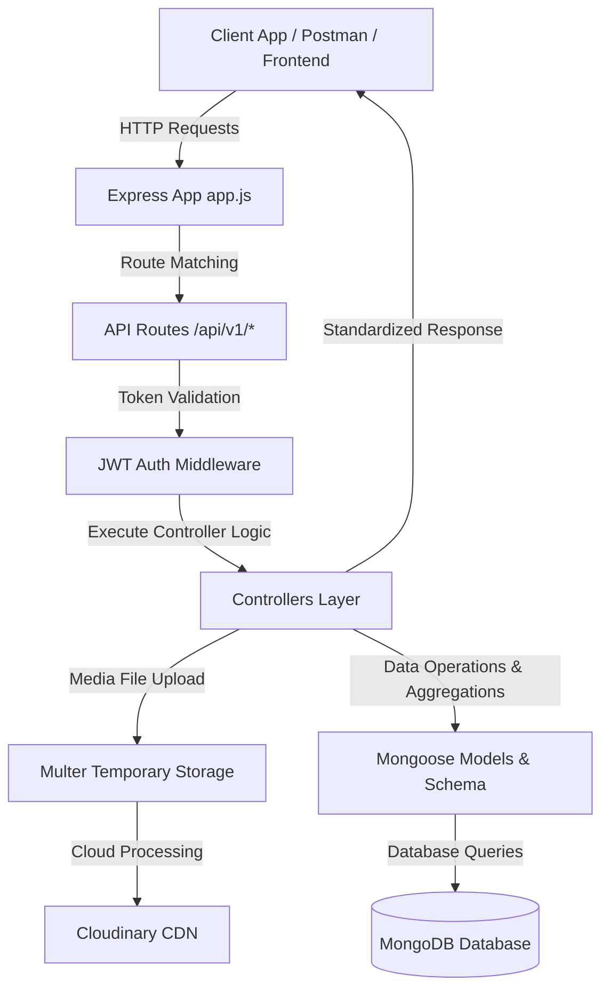

# 🚀 Backend Production-Ready API Platform

[](https://nodejs.org/)
[](https://expressjs.com/)
[](https://www.mongodb.com/)
[](https://cloudinary.com/)
[](https://jwt.io/)
[](https://opensource.org/licenses/ISC)

A production-ready, feature-rich backend RESTful API platform built with **Node.js**, **Express.js**, **MongoDB**, and **Cloudinary**. Designed to power modern video-sharing platforms and social media networks (similar to YouTube & Twitter combined), featuring secure authentication, media uploading, complex aggregation pipelines, subscription workflows, and real-time dashboard analytics.

---

## 📌 Table of Contents

- [Overview](#-overview)
- [Key Features](#-key-features)
- [Tech Stack & Tools](#-tech-stack--tools)
- [Project Architecture](#-project-architecture)
- [Directory Structure](#-directory-structure)
- [Getting Started](#-getting-started)
  - [Prerequisites](#prerequisites)
  - [Installation](#installation)
  - [Environment Variables](#environment-variables)
  - [Running the Server](#running-the-server)
- [API Endpoints Reference](#-api-endpoints-reference)
  - [Authentication & Users](#1-user--authentication-api-apiv1users)
  - [Videos](#2-video-management-api-apiv1videos)
  - [Tweets](#3-tweets-api-apiv1tweets)
  - [Comments](#4-comments-api-apiv1comments)
  - [Likes](#5-likes-api-apiv1likes)
  - [Playlists](#6-playlists-api-apiv1playlist)
  - [Subscriptions](#7-subscriptions-api-apiv1subscriptions)
  - [Dashboard](#8-dashboard-analytics-api-apiv1dashboard)
  - [Healthcheck](#9-health-check-api-apiv1healthcheck)
- [Standardized Response & Error Handling](#-standardized-response--error-handling)
- [Author & License](#-author--license)

---

## 🌟 Overview

This backend system provides a complete set of backend APIs for a full-fledged video hosting and social interaction platform. It implements industry best practices, modular code architecture, secure authentication mechanisms using short-lived Access Tokens and long-lived Refresh Tokens (stored in HTTP-Only cookies), file upload pipelines via **Multer** & **Cloudinary**, and advanced MongoDB aggregation framework pipelines.

---

## ✨ Key Features

- 🔒 **Authentication & Authorization**:
  - JWT-based authentication (Access & Refresh tokens).
  - Encrypted passwords using `bcrypt`.
  - Secure token storage via HTTP-only cookies.
- 👤 **User Profile & Channel Management**:
  - Avatar and Cover Image uploading & updating via Cloudinary.
  - Channel profile stats (subscribers count, subscribed channels count, subscription status).
  - Watch history tracking and user details updates.
- 📹 **Video Management**:
  - Cloudinary video and thumbnail storage.
  - Publishing, editing title/description/thumbnails, and deleting videos.
  - Video search, sorting, pagination, and visibility toggling (public/private).
- 💬 **Comment & Social Feed (Tweets)**:
  - Nested post/tweet creation, updates, and deletion.
  - Video comments with paginated listing and authorization checks.
- 👍 **Like System**:
  - Universal like toggles for videos, comments, and tweets.
  - Fetch user's liked videos playlist.
- 📁 **Playlist Management**:
  - Custom user playlists (create, edit title/description, delete).
  - Add or remove specific videos to/from playlists.
- 🔔 **Subscription Model**:
  - Channel subscribe/unsubscribe capabilities.
  - Fetch channel subscribers and user-subscribed channels.
- 📊 **Dashboard & Analytics**:
  - Channel metrics overview (total views, total subscribers, total videos, total likes).
  - Channel uploaded videos manager.

---

## 🛠 Tech Stack & Tools

| Technology                         | Purpose                                                    |
| :--------------------------------- | :--------------------------------------------------------- |
| **Node.js**                        | JavaScript runtime environment                             |
| **Express.js (v5)**                | Web application framework for building REST APIs           |
| **MongoDB & Mongoose**             | NoSQL Database & ODM with complex Aggregation Pipelines    |
| **Mongoose Aggregate Paginate V2** | Efficient pagination for database aggregations             |
| **JSON Web Tokens (JWT)**          | Stateless authentication with Access & Refresh tokens      |
| **Bcrypt**                         | Hashing & securing user passwords                          |
| **Multer**                         | Middleware for handling `multipart/form-data` file uploads |
| **Cloudinary SDK**                 | Cloud storage for video and image asset uploads            |
| **Cookie-Parser**                  | Middleware to parse and handle HTTP cookies                |
| **CORS & Dotenv**                  | Security cross-origin requests & environment configuration |
| **Nodemon & Prettier**             | Development automation & code formatting                   |

---

## 🏗 Project Architecture



---

## 📂 Directory Structure

```text
Backend-Project/
├── .env.sample                 # Environment configuration template
├── .gitignore                  # Git ignore rules
├── .prettierrc                 # Code formatting rules
├── .prettierignore             # Prettier ignore rules
├── package.json                # Project dependencies and npm scripts
├── public/                     # Local temporary upload storage
│   └── temp/
└── src/                        # Main Application Codebase
    ├── app.js                  # Express app setup & middleware configuration
    ├── index.js                # Database connection & server bootstrap
    ├── constants.js            # Global app constants (DB Name, etc.)
    ├── db/
    │   └── index.js            # MongoDB connection logic
    ├── controllers/            # Controller business logic
    │   ├── comment.controller.js
    │   ├── dashboard.controller.js
    │   ├── healthcheck.controller.js
    │   ├── like.controller.js
    │   ├── playlist.controller.js
    │   ├── subscription.controller.js
    │   ├── tweet.controller.js
    │   ├── user.controller.js
    │   └── video.controller.js
    ├── middlewares/            # Custom Middlewares
    │   ├── auth.middleware.js  # JWT Verification
    │   └── multer.middleware.js# File Upload Middleware
    ├── models/                 # Database Schemas & Models
    │   ├── comment.model.js
    │   ├── like.model.js
    │   ├── playlist.model.js
    │   ├── subscription.model.js
    │   ├── tweet.model.js
    │   ├── user.model.js
    │   └── video.model.js
    ├── routes/                 # Express API Route definitions
    │   ├── comment.routes.js
    │   ├── dashboard.routes.js
    │   ├── healthcheck.routes.js
    │   ├── like.routes.js
    │   ├── playlist.routes.js
    │   ├── subscription.routes.js
    │   ├── tweet.routes.js
    │   ├── user.routes.js
    │   └── video.routes.js
    └── utils/                  # Helper Utilities
        ├── ApiError.js         # Custom API Error class
        ├── ApiResponse.js      # Custom API Response wrapper
        ├── asyncHandler.js     # Async wrapper for route handlers
        └── Cloudinary.js       # Cloudinary media uploader utility
```

---

## 🚀 Getting Started

### Prerequisites

Make sure you have the following installed on your local development machine:

- [Node.js](https://nodejs.org/) (v18 or higher)
- [MongoDB](https://www.mongodb.com/) (Local server or MongoDB Atlas cluster)
- A [Cloudinary Account](https://cloudinary.com/) for media management.

### Installation

1. **Clone the Repository**:

   ```bash
   git clone https://github.com/SalmanAfridi-1043/backend-project.git
   cd backend-project
   ```

2. **Install Dependencies**:
   ```bash
   npm install
   ```

### Environment Variables

Create a `.env` file in the root directory by copying `.env.sample`:

```bash
cp .env.sample .env
```

Fill in your environment configuration parameters:

```env
PORT=8000
MONGODB_URI=mongodb+srv://<username>:<password>@cluster.mongodb.net
CORS_ORIGIN=*

ACCESS_TOKEN_SECRET=your_super_secret_access_key
ACCESS_TOKEN_EXPIRY=1d

REFRESH_TOKEN_SECRET=your_super_secret_refresh_key
REFRESH_TOKEN_EXPIRY=10d

CLOUDINARY_CLOUD_NAME=your_cloudinary_cloud_name
CLOUDINARY_API_KEY=your_cloudinary_api_key
CLOUDINARY_API_SECRET=your_cloudinary_api_secret
```

### Running the Server

- **Development Mode** (with hot reloading via Nodemon):
  ```bash
  npm run dev
  ```

Server will start listening at: `http://localhost:8000`

---

## 🔌 API Endpoints Reference

All endpoints are prefixed with `/api/v1`.

### 1. User & Authentication API (`/api/v1/users`)

| Method  | Endpoint                  | Description                                  | Auth Required |     File Upload      |
| :------ | :------------------------ | :------------------------------------------- | :-----------: | :------------------: |
| `POST`  | `/register`               | Register a new user profile                  |      ❌       | Avatar & Cover Image |
| `POST`  | `/login`                  | Log in user & receive Access/Refresh cookies |      ❌       |         None         |
| `POST`  | `/logout`                 | Log out user & invalidate refresh token      |      ✅       |         None         |
| `POST`  | `/refresh-token`          | Renew access token using refresh token       |      ❌       |         None         |
| `POST`  | `/change-password`        | Change user account password                 |      ✅       |         None         |
| `POST`  | `/current-user`           | Get logged-in user profile details           |      ✅       |         None         |
| `PATCH` | `/update-account`         | Update account details (fullname, email)     |      ✅       |         None         |
| `PATCH` | `/change-avatar`          | Update user avatar image                     |      ✅       |     Avatar file      |
| `PATCH` | `/change-coverimage`      | Update user profile cover image              |      ✅       |   Cover image file   |
| `GET`   | `/channel-info/:username` | Fetch channel profile stats                  |      ✅       |         None         |
| `GET`   | `/watch-history`          | Get user's video watch history               |      ✅       |         None         |

---

### 2. Video Management API (`/api/v1/videos`)

| Method   | Endpoint                   | Description                               | Auth Required |    File Upload    |
| :------- | :------------------------- | :---------------------------------------- | :-----------: | :---------------: |
| `GET`    | `/`                        | Get all videos (Paginated, Search & Sort) |      ✅       |       None        |
| `POST`   | `/`                        | Publish a new video                       |      ✅       | Video & Thumbnail |
| `GET`    | `/:videoId`                | Get video details by ID                   |      ✅       |       None        |
| `PATCH`  | `/:videoId`                | Update video details & thumbnail          |      ✅       |     Thumbnail     |
| `DELETE` | `/:videoId`                | Delete video permanently                  |      ✅       |       None        |
| `PATCH`  | `/toggle/publish/:videoId` | Toggle video publish status               |      ✅       |       None        |

---

### 3. Tweets API (`/api/v1/tweets`)

| Method   | Endpoint        | Description                       | Auth Required |
| :------- | :-------------- | :-------------------------------- | :-----------: |
| `POST`   | `/`             | Create a new tweet                |      ✅       |
| `GET`    | `/user/:userId` | Get all tweets by a specific user |      ✅       |
| `PATCH`  | `/:tweetId`     | Edit tweet content                |      ✅       |
| `DELETE` | `/:tweetId`     | Delete a tweet                    |      ✅       |

---

### 4. Comments API (`/api/v1/comments`)

| Method   | Endpoint        | Description                          | Auth Required |
| :------- | :-------------- | :----------------------------------- | :-----------: |
| `GET`    | `/:videoId`     | Get comments for a video (Paginated) |      ✅       |
| `POST`   | `/:videoId`     | Add a comment to a video             |      ✅       |
| `PATCH`  | `/c/:commentId` | Update a comment                     |      ✅       |
| `DELETE` | `/c/:commentId` | Delete a comment                     |      ✅       |

---

### 5. Likes API (`/api/v1/likes`)

| Method | Endpoint               | Description                            | Auth Required |
| :----- | :--------------------- | :------------------------------------- | :-----------: |
| `POST` | `/toggle/v/:videoId`   | Toggle like on a video                 |      ✅       |
| `POST` | `/toggle/c/:commentId` | Toggle like on a comment               |      ✅       |
| `POST` | `/toggle/t/:tweetId`   | Toggle like on a tweet                 |      ✅       |
| `GET`  | `/videos`              | Get all videos liked by logged-in user |      ✅       |

---

### 6. Playlists API (`/api/v1/playlist`)

| Method   | Endpoint                       | Description                           | Auth Required |
| :------- | :----------------------------- | :------------------------------------ | :-----------: |
| `POST`   | `/`                            | Create a new playlist                 |      ✅       |
| `GET`    | `/:playlistId`                 | Fetch playlist by ID                  |      ✅       |
| `PATCH`  | `/:playlistId`                 | Update playlist title and description |      ✅       |
| `DELETE` | `/:playlistId`                 | Delete playlist                       |      ✅       |
| `PATCH`  | `/add/:videoId/:playlistId`    | Add a video to a playlist             |      ✅       |
| `PATCH`  | `/remove/:videoId/:playlistId` | Remove a video from a playlist        |      ✅       |
| `GET`    | `/user/:userId`                | Get all playlists of a user           |      ✅       |

---

### 7. Subscriptions API (`/api/v1/subscriptions`)

| Method | Endpoint           | Description                              | Auth Required |
| :----- | :----------------- | :--------------------------------------- | :-----------: |
| `POST` | `/c/:channelId`    | Toggle subscription status for a channel |      ✅       |
| `GET`  | `/c/:channelId`    | Get list of subscribers for a channel    |      ✅       |
| `GET`  | `/u/:subscriberId` | Get channels subscribed by a user        |      ✅       |

---

### 8. Dashboard Analytics API (`/api/v1/dashboard`)

| Method | Endpoint  | Description                                                   | Auth Required |
| :----- | :-------- | :------------------------------------------------------------ | :-----------: |
| `GET`  | `/stats`  | Get overall channel stats (Views, Subscribers, Videos, Likes) |      ✅       |
| `GET`  | `/videos` | Get all videos uploaded by the channel                        |      ✅       |

---

### 9. Health Check API (`/api/v1/healthcheck`)

| Method | Endpoint | Description                  | Auth Required |
| :----- | :------- | :--------------------------- | :-----------: |
| `GET`  | `/`      | Server health check endpoint |      ❌       |

---

## 📦 Standardized Response & Error Handling

All responses follow a consistent JSON structure across the entire application for seamless frontend integration.

### Success Response Structure

```json
{
  "statusCode": 200,
  "data": {
    "_id": "64f1a2b3c4d5e6f7a8b9c0d1",
    "username": "salman_afridi",
    "email": "salman@example.com"
  },
  "message": "User fetched successfully",
  "success": true
}
```

### Error Response Structure

```json
{
  "statusCode": 401,
  "data": null,
  "message": "Unauthorized request / Invalid Refresh Token",
  "success": false
}
```

---

## 👨‍💻 Author & License

Developed with ❤️ by **[Salman Afridi](https://github.com/SalmanAfridi-1043)**

This project is licensed under the **ISC License**. Feel free to use, modify, and distribute it for personal or commercial projects.
